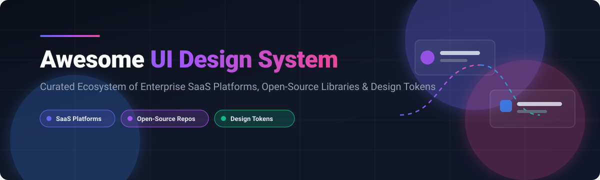

  
  
  
  
  
  

  

# 🎨 Awesome UI Design System

> 🚀 **Curated Catalog of SaaS Design Platforms, Open-Source Component Libraries, DTCG Tokens & Documentation Engine Frameworks.**

Welcome to **Awesome UI Design System**, the definitive index of commercial design system platforms and open-source frontend infrastructure tools. Designed for **design system engineers, UI/UX architects, and enterprise frontend leaders**, this list tracks component architecture, token sync automation, visual testing, and AI-ready design workflows.

---

## 📑 Table of Contents
- [🏢 Enterprise SaaS & Hosted Platforms](#-enterprise-saas--hosted-platforms)
- [⭐ Open-Source GitHub Projects](#-open-source-github-projects)
- [🛠️ Integration & Governance Stacks](#%EF%B8%8F-integration--governance-stacks)
- [🤝 How to Contribute](#-how-to-contribute)
- [⚖️ Disclaimer & Licensing](#%EF%B8%8F-disclaimer--licensing)
- [💖 Support](#-support)
- [📈 Star History](#-star-history)

---

## 🏢 Enterprise SaaS & Hosted Platforms

> 📊 **Estimated Market Size & Sector Dynamics**: The global **UI Design System & Component Infrastructure market** is valued at **~$3.5 Billion (2026)** and projected to reach **$7.8 Billion by 2030 (21.5% CAGR)**. The sector is **highly concentrated at the core design canvas level** (dominated by Figma & Adobe), while remaining **moderately fragmented across token automation, enterprise documentation, and code-sync platform tools**.

| 🏢 SaaS Platform | 💰 Starting Paid Price | 🆓 Free Tier Limit | 🏢 Company Scale (Valuation / Revenue) | 🎯 Primary Focus & Strengths |
| :--- | :--- | :--- | :--- | :--- |
| **[Salesforce Lightning](https://www.lightningdesignsystem.com/)** | $25/user/month (Salesforce Starter) | 30-day free trial with Developer Sandbox access | **~$270 Billion** Market Cap | Enterprise Salesforce CRM design consistency & governance |
| **[Adobe XD](https://www.adobe.com/products/xd.html)** | $9.99/user/month (Single App Plan) | Starter Plan free forever: 1 shared prototype & 1 shared design spec | **~$250 Billion** Market Cap (Adobe Inc.) | Prototyping and design spec handoff within Creative Cloud |
| **[Figma](https://www.figma.com/)** | $12/editor/month (Professional, annual) | Starter Plan free forever: 3 Figma & 3 FigJam files, 1 team project | **~$12.5 Billion** Valuation ($1.0B ARR) | Design source of truth, real-time collaboration & Dev Mode |
| **[Zeroheight](https://zeroheight.com/)** | $49/editor/month (Starter plan) | Free Plan forever: 1 styleguide, 2 editors, unlimited view-only reviewers | **~$50 Million** Valuation ($10M Series A) | Centralized external-facing design system documentation |
| **[Backlight](https://backlight.dev/)** | $39/editor/month (Pro plan) | Free Plan forever: Up to 3 contributors & 1 active project | **~$15 Million** Valuation ($2.5M Seed) | Code-first component playground & design token integration |
| **[Specify](https://specifyapp.com/)** | $39/month (Starter plan) | 14-day free trial: Up to 3 repositories & 5 team members | **~$12 Million** Valuation ($4.5M Seed) | Automated DTCG design token sync between Figma & Git |
| **[Supernova](https://www.supernova.io/)** | $20/editor/month (Company plan) | Free Plan forever: 1 design system, 1 editor, unlimited viewers | **~$10 Million** Valuation ($4.8M Seed) | End-to-end token management & dynamic documentation |
| **[Tokens Studio](https://tokens.studio/)** | $3/editor/month (Pro plan) | Free Plugin forever: Local Figma token management & 1 token set | **~$8 Million** Valuation ($1.5M ARR) | Advanced Figma token editing, multi-brand themes & git sync |
| **[Knapsack](https://knapsack.cloud/)** | $500/month (Team plan) | 14-day free trial: Full platform access for up to 5 team members | **~$5 Million** Valuation ($3.1M Seed) | Enterprise cross-functional design system orchestration |

---

## ⭐ Open-Source GitHub Projects

Below is a curated collection of top open-source component libraries, design systems, and token infrastructure repositories. Repositories are **sorted in descending order by GitHub Stars_Count**.

1. **[shadcn/ui](https://github.com/shadcn-ui/ui)**   
   ⚡ **Copy-paste component architecture** built on Radix UI and Tailwind CSS. Components are copied directly into codebases for complete ownership. *MIT Licensed*.

2. **[Ant Design](https://github.com/ant-design/ant-design)**   
   🏮 **Enterprise-class UI design language and React component library** created by Alibaba. Packed with rich data-entry and data-display components. *MIT Licensed*.

3. **[Material UI (MUI)](https://github.com/mui/material-ui)**   
   📦 **Comprehensive React UI component library** implementing Google's Material Design. Ideal for fast production builds with extensive customizability. *MIT Licensed*.

4. **[Tailwind CSS](https://github.com/tailwindlabs/tailwindcss)**   
   🎨 **Utility-first CSS framework** serving as the foundational styling layer for modern design systems and atomic CSS token management. *MIT Licensed*.

5. **[Storybook](https://github.com/storybookjs/storybook)**   
   📖 **Industry standard workshop for building, testing, and documenting UI components** in isolation. Supports React, Vue, Angular, Svelte, and Web Components. *MIT Licensed*.

6. **[Penpot](https://github.com/penpot/penpot)**   
   ✏️ **Open-source vector design & prototyping tool** built on web standards (SVG/CSS). Features native W3C design tokens and MCP AI server support. *MPL-2.0 Licensed*.

7. **[Vuetify](https://github.com/vuetifyjs/vuetify)**   
   🟢 **Vue.js Material Design component framework** providing hand-crafted, accessible UI elements for Vue 3 applications. *MIT Licensed*.

8. **[Chakra UI](https://github.com/chakra-ui/chakra-ui)**   
   ⚡ **Simple, modular, and accessible React component library** designed for rapid UI creation with intuitive style props. *MIT Licensed*.

9. **[Mantine](https://github.com/mantinedev/mantine)**   
   🛡️ **Full-featured React component library** with 100+ customizable components and hooks out of the box. *MIT Licensed*.

10. **[Fluent UI (Microsoft)](https://github.com/microsoft/fluentui)**   
    🪟 **Microsoft's cross-platform design system** delivering consistent UX across Web, Windows, iOS, and Android applications. *MIT Licensed*.

11. **[Radix UI Primitives](https://github.com/radix-ui/primitives)**   
    🧱 **Unstyled, accessible UI component primitives** for React. Serves as the building block for custom design systems. *MIT Licensed*.

12. **[Material Components Web](https://github.com/material-components/material-components-web)**   
    🌐 **Google's reference web implementation of Material Design** components. *Apache-2.0 Licensed*.

13. **[Evergreen (Segment)](https://github.com/segmentio/evergreen)**   
    🌲 **Segment's React UI framework** crafted for building enterprise web applications. *MIT Licensed*.

14. **[StyleX (Meta)](https://github.com/facebook/stylex)**   
    ♾️ **Meta's atomic CSS-in-JS styling engine** powering Facebook and WhatsApp design token distribution. *MIT Licensed*.

15. **[Carbon Components (IBM)](https://github.com/ibm/carbon-components)**   
    🔵 **IBM's open-source design system** supporting React, Angular, Vue, and Svelte frontend ecosystems. *Apache-2.0 Licensed*.

16. **[Panda CSS](https://github.com/chakra-ui/panda)**   
    🐼 **Build-time type-safe CSS-in-JS engine** designed for atomic styling and design token generation. *MIT Licensed*.

17. **[Primer (GitHub)](https://github.com/primer/react)**   
    🐙 **GitHub's official React design system** delivering accessible components matching GitHub's product look and feel. *MIT Licensed*.

18. **[Tokens Studio Figma Plugin](https://github.com/tokens-studio/figma-plugin)**   
    🔌 **Open-source Figma plugin repository** for managing design tokens and syncing token files with Git repositories. *MIT Licensed*.

19. **[GOV.UK Design System](https://github.com/alphagov/govuk-design-system)**   
    🏛️ **UK Government digital service design system** focused on public sector accessibility standards. *MIT Licensed*.

---

## 🛠️ Integration & Governance Stacks

When architecting an enterprise design system solution:
- 🏗️ **Component Layer**: Combine **shadcn/ui**, **MUI**, or **Radix UI** for component composition and accessibility.
- 📐 **Styling & Tokens**: Leverage **Tailwind CSS**, **StyleX**, or **Panda CSS** alongside **Tokens Studio** for W3C DTCG token definitions.
- 🧪 **Development & Handoff**: Deploy **Storybook** for component development and **Penpot** for web-native vector collaboration.
- 🏢 **Enterprise Documentation & Portal**: Utilize platforms like **Zeroheight**, **Supernova**, or **Knapsack** for cross-functional governance and documentation portals.

---

## 🤝 How to Contribute

1. 🍴 Fork the repository.
2. 📝 Add or edit entries in `README.md` maintaining table/list structure and Stars_Badges.
3. 📌 Ensure entries include official links, factual descriptions, pricing/licensing context, and repository tags.
4. 🚀 Submit a Pull Request with a clear description of changes.

---

## ⚖️ Disclaimer & Licensing

- 💡 This repository is a **community-curated index** for informational and educational purposes.
- 🔐 Design system platforms manage brand assets and proprietary component code. Enterprise deployments require proper access governance, compliance review, and licensing verification.
- 🤖 **AI-Ready Infrastructure**: Modern tools (Penpot, shadcn/ui, Tokens Studio) increasingly feature Model Context Protocol (MCP) integrations and CLI tooling for AI coding assistants.

---

## 💖 Support

Thank you for exploring **Awesome UI Design System**! If you find this curated ecosystem list helpful, please consider supporting the project:

- ⭐ **Star** this repository on GitHub to show your appreciation.
- 🔀 **Fork** and contribute new design system tools, token workflows, or component libraries.
- 📢 **Share** it with fellow design system engineers and frontend architects.
- ☕ **Sponsor**: Buy me a coffee or support ongoing maintenance via the [GitHub Sponsor Dashboard](https://github.com/sponsors/ishandutta2007).

---

## 📈 Star History

---

  <b>Built for design system engineers, frontend architects, and UI engineering teams.</b> 
  <i>Let's build consistent, accessible, and scalable design system ecosystems.</i>

